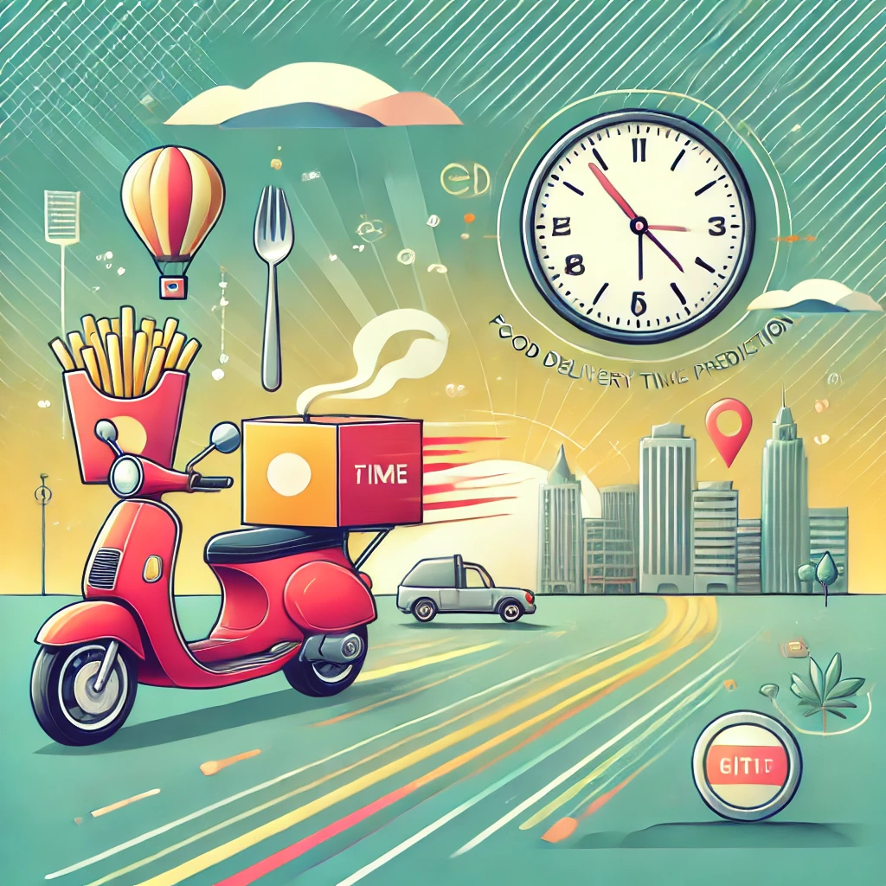

# Food Delivery Time Prediction

[](https://www.python.org/downloads/release/python-360/) [](https://scikit-learn.org/stable/whats_new.html)

## Introduction

Running a food delivery service comes with the challenge of keeping customers happy by delivering their meals on time and in good condition despite hurdles like traffic or bad weather, which can throw off the schedule unpredictably.

To address this issue effectively, we have developed a **Food Delivery Time Prediction System** that utilizes machine learning methods. Our goal is to predict delivery times with precision by analyzing delivery data, current traffic situations, and real-time weather trends.

We have also developed a **Command Line Interface (CLI)** to allow users to input food delivery parameters and get delivery time predictions. This tool provides an estimate of the food delivery time within specific ranges:

- **Very Quick:** ≤ 15 minutes  
- **Quick:** 15–30 minutes  
- **Moderate:** 30–45 minutes  
- **Slow:** 45–60 minutes  
- **Very Slow:** ≥ 60 minutes  



## Directory Structure

```
Food-Delivery-Time-Prediction/
│
├── Data Pre Processing/
│   └── pre-processing.py
│
├── datasets/
│   ├── kaggle/
│   │   ├── train.csv
│   │   ├── test.csv
│   │   └── README.md
│   │
│   ├── kbest features/
│   │   └── kbest_features.csv
│   │
│   └── new/
│       ├── train.csv
│       └── test.csv
│
├── EDA/
│   ├── EDA_plots/
│   │   ├── boxplot_City.png
│   │   ├── boxplot_Festival.png
│   │   ├── boxplot_Road_traffic_density.png
│   │   ├── boxplot_Type_of_order.png
│   │   ├── boxplot_Type_of_vehicle.png
│   │   ├── boxplot_Weatherconditions.png
│   │   ├── histogram_Delivery_location_latitude.png
│   │   ├── histogram_Delivery_location_longitude.png
│   │   ├── histogram_Delivery_person_Age.png
│   │   ├── histogram_Delivery_person_Rating.png
│   │   ├── histogram_Distance.png
│   │   ├── histogram_Multiple_deliveries.png
│   │   ├── histogram_Restaurant_latitude.png
│   │   ├── histogram_Restaurant_longitude.png
│   │   ├── histogram_Time_taken(min).png
│   │   ├── histogram_Vehicle_condition.png
│   │   ├── pairplot.png
│   │   ├── umap_projection.png
│   │   ├── violinplot_City.png
│   │   ├── violinplot_Festival.png
│   │   ├── violinplot_Road_traffic_density.png
│   │   ├── violinplot_Type_of_order.png
│   │   ├── violinplot_Type_of_vehicle.png
│   │   └── violinplot_Weatherconditions.png
│   │
│   ├── analysis.py
│   └── umap_and_heatmap.ipynb
│
├── Feature Selection/
│   ├── Helper Files/
│   │   └── random_forest_importance.py
│   │
│   ├── aggregated_feature_scores.csv
│   ├── feature_scores.txt
│   ├── kbest.py
│   └── save_kbest_features.py
│
├── fig/
│   └── image.png
│
├── models/
│   ├── Helper files/
│   │   ├── elasticnetRegularization.ipynb
│   │   ├── k_cross_validation.py
│   │   ├── lightGBM.ipynb
│   │   ├── linear-regression-onehot.py
│   │   ├── linear-regression.ipynb
│   │   ├── random-forest.ipynb
│   │   ├── SVM.ipynb
│   │   └── xgboost.py
│   │
│   ├── Plots/
│   │   ├── decision-tree-bagging.png
│   │   ├── decision-tree.png
│   │   ├── k_cross_validation.png
│   │   ├── linear-regression.png
│   │   ├── random-forest-2.png
│   │   └── random-forest.png
│   │
│   ├── accuracies.txt
│   ├── decision-tree-bagging.py
│   ├── decision-tree.py
│   ├── elasticnetRegularization.py
│   ├── k_cross_validation.py
│   ├── lightGBM.py
│   ├── linear-regression.py
│   ├── random-forest.py
│   ├── svm.py
│   └── tracking_XGBoost.py
│
├── Reports/
│   ├── Proposal/
│   │   ├── proposal.pdf
│   │   ├── proposal.tex
│   ├── MidSem Report/
│   │   ├── ML Project MidSem Report.pdf
│   │   ├── ML Project MidSem Project Slides.pdf
│   │   └── ML Project MidSem Report.tex
│   │
│   └── Final Report/
│       ├── final_report.tex
│       ├── final_report.pdf
│       ├── cross_validation.png
│       ├── decision-tree.png
│       ├── decision-tree-bagging.png
│       ├── random-forest.png
│       ├── random-forest-2.png
│       ├── linear-regression.png
│       └── xgboost.png
│
├── .gitignore
├── .pre-commit-config.yaml
├── LICENSE
├── main.py
├── predictor-accuracy.py
├── README.md
└── requirements.txt
```

## Getting Started

All scripts have been tested on Python 3.6.8 with scikit-learn 1.3.2. The scripts can run on either CPU or GPU.

### Setting up the Environment

1. Clone the repository:
   ```bash
   git clone https://github.com/Vikranth3140/Food-Delivery-Time-Prediction.git
   cd Food-Delivery-Time-Prediction
   ```

2. Create a virtual environment and install dependencies:
   ```bash
   python3 -m venv ./env
   source env/bin/activate
   pip install -r requirements.txt
   ```

### Setting up Datasets

The datasets used in this project are available on [Kaggle](https://www.kaggle.com/datasets/gauravmalik26/food-delivery-dataset). Place the dataset files in the `datasets/` directory.

---

## Data Preprocessing

The preprocessing steps include:

1. Standardizing columns into appropriate formats: strings, integers, and floats.
2. Converting order date to `datetime` format.
3. Extracting time from `Time Ordered` and `Time Order Picked`.
4. Dropping rows with null values.
5. Encoding categorical variables using label encoding.

### Feature Selection

Features were selected using `SelectKBest` to retain only the most significant predictors, as implemented in [kbest.py](Feature%20Selection/kbest.py).

---

## Model Improvement

The following techniques were applied to improve model performance:
- **Hyperparameter Tuning:** Using `GridSearchCV` to optimize model parameters.

---

## Command Line Interface (CLI)

To use the CLI for predictions:
1. Navigate to the project directory.
2. Run the CLI script:
   ```bash
   python main.py
   ```

Follow the prompts to input the delivery parameters and obtain predictions.

---

## Model Evaluation Results

| Model                     | MSE    | R² Score |
|---------------------------|--------|----------|
| Linear Regression         | 42.80  | 0.51     |
| Decision Tree             | 41.14  | 0.53     |
| Decision Tree (Bagging)   | 21.67  | 0.75     |
| Random Forest             | 21.21  | 0.75     |
| Elastic Net Regularization| 47.35  | 0.46     |
| LightGBM                  | 16.88  | 0.80     |
| XGBoost                   | 18.41  | 0.79     |

---

The developed LightGBM model demonstrates promising accuracy and generalization capabilities, facilitating informed decision-making in the food delivery space to predict delivery time.

---

## Conclusion

The **LightGBM model** demonstrates high accuracy and generalization, making it the most suitable for delivery time predictions in this context.

---

## Contact

For any queries or feedback, feel free to reach out to:

- [Vikranth Udandarao](mailto:vikranth22570@iiitd.ac.in)
- [Mohmmad Ayaan](mailto:ayaan22302@iiitd.ac.in)
- [Swara Parekh](mailto:swara22524@iiitd.ac.in)
- [Ananya Garg](mailto:ananya22068@iiitd.ac.in)

---

## License

This project is licensed under the [MIT License](LICENSE).
